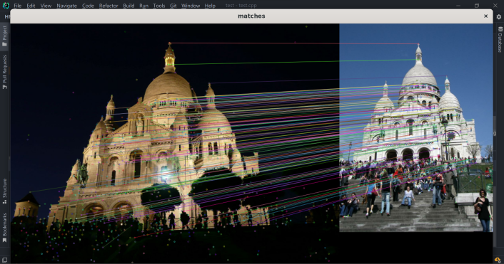

# HF-VINS
using hloc in VINS

## **TODO List**

- [x] Refactoring hloc with TensorScript
- [x] Read and run models in C++
- [x] class SuperPointExtractor
- [x] class NetVLADExtractor
- [x] class SuperGlueMatcher?
- [ ] class Keyframe Database: It should include two functions 1) to get the similarity of a new frame to the global descriptors of all frames in the database 2) to add the current keyframe to the database.
- [ ] Rewrite VINS-Mono/pose_graph

## **visualization**

