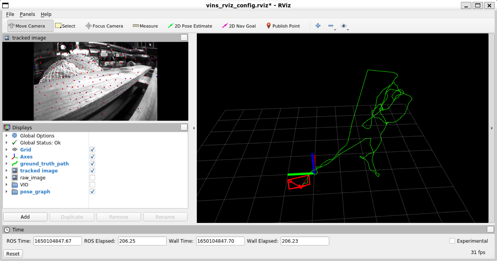

# HF-VINS
using **[Hierarchical-Localization](https://github.com/cvg/Hierarchical-Localization)** in **[VINS-Mono](https://github.com/HKUST-Aerial-Robotics/VINS-Mono)**

## **TODO List**

- [x] Refactoring hloc with TensorScript
- [x] Read and run models in C++
- [x] class SuperPointExtractor
- [x] class NetVLADExtractor
- [x] class SuperGlueMatcher
- [x] class UltraPoint

night: SuperPoint keypoints + SuperPoint descriptors

day: goodFeaturesToTrack keypoints + SuperPoint descriptors (I call it UltraPoint, because the model just extracts the descriptors, it's not that super)

using SuperGlue match those keypoints

- [x] class Keyframe Database: It should include two functions 1) to get the similarity of a new frame to the global descriptors of all frames in the database 2) to add the current keyframe to the database.
- [x] Rewrite VINS-Mono/pose_graph/keyframe
- [ ] Rewrite VINS-Mono/pose_graph/*

The initialisation of those models is done before the first call, which makes the back-end stuck for a while at the beginning.

- [x] Visualisation of loop frame matching
- [x] Initialise all singleton instances of models at boot time
- [ ] Add the function to save and load pose graph

**There was a problem.**

Our loop detection uses NetVLAD, which is independent of the extraction of feature points and descriptors. This leads to the fact that the number of matching keypoints obtained by SuperGlue is not sufficient for relocation when NetVLAD think that was a loop. Therefore, it is important to set thresholds for loop detection, and it is even somewhat problematic to set different thresholds for different data sets.

I have now set a threshold of 0.4 on the EuRoC dataset and it looks OK.

Another idea is to increase the number of SuperPoints in the loop frames, but this may cause more time cost.